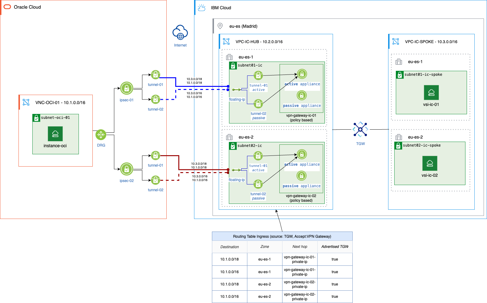
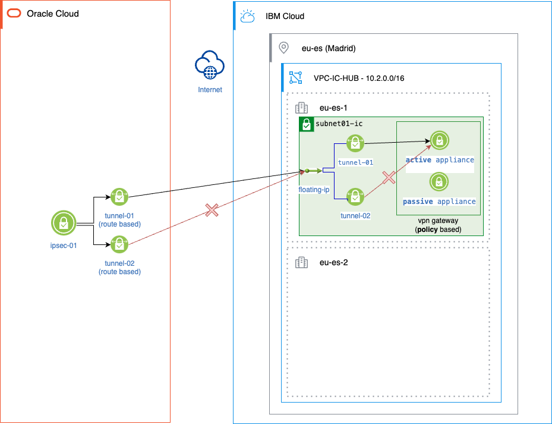
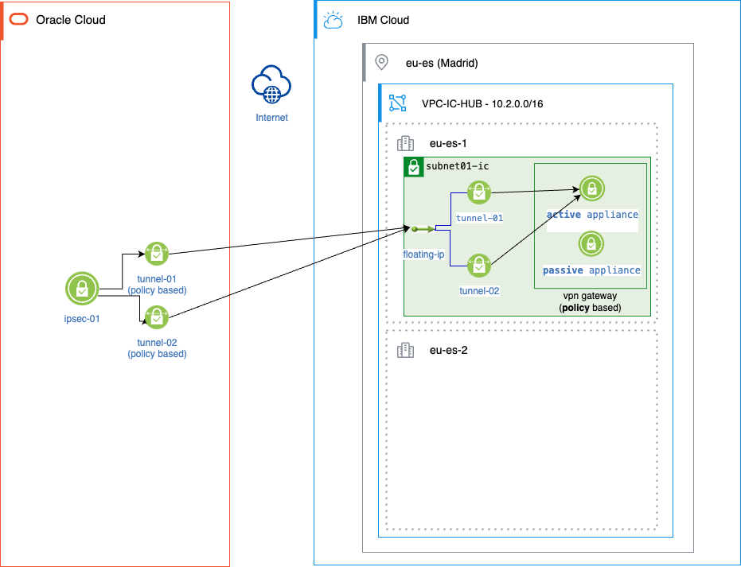
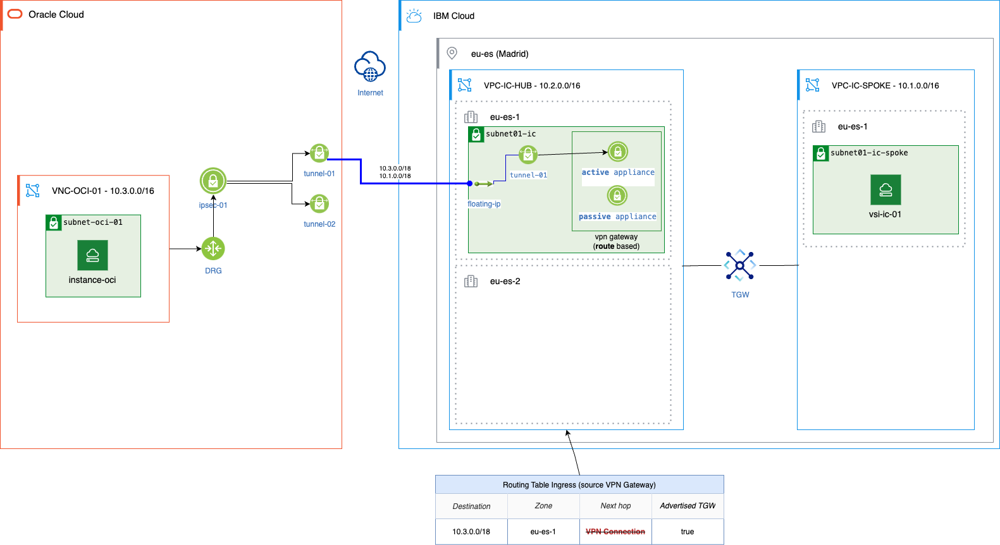
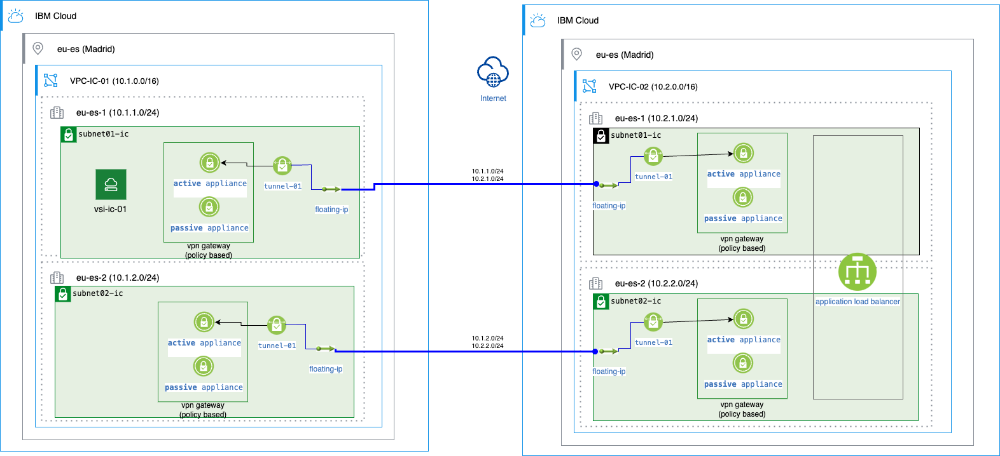
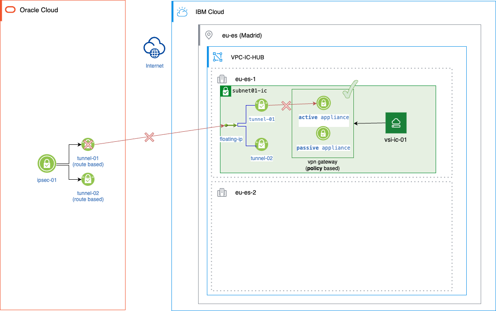
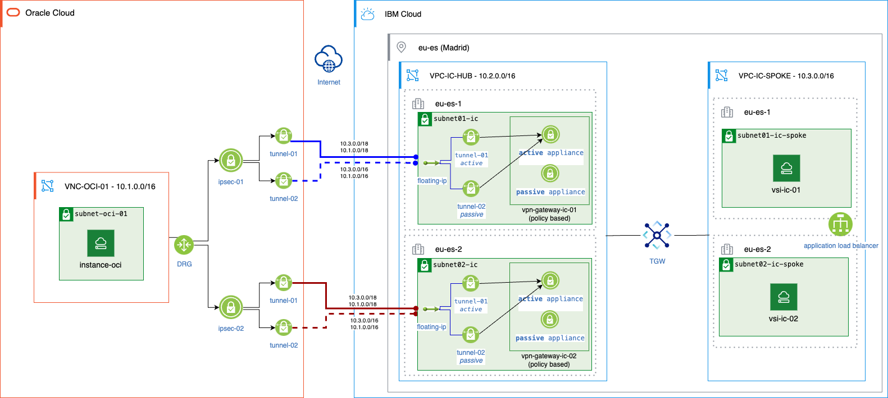
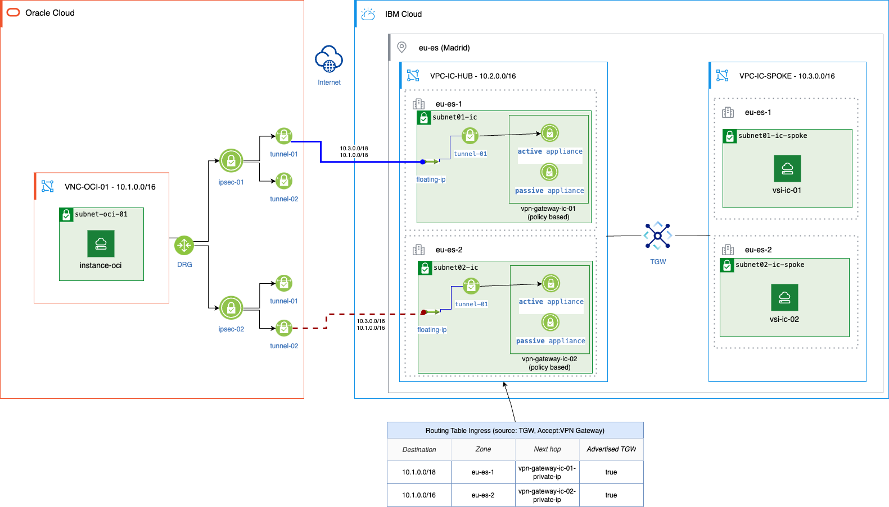

```
IBM Legacy Public Repository Disclosure: All content in this repository including code has been provided by IBM under the associated open source software license and IBM is under no obligation to provide enhancements, updates, or support. IBM developers produced this code as an open source project (not as an IBM product), and IBM makes no assertions as to the level of quality nor security, and will not be maintaining this code going forward
```

# Introduction
This repository demonstrates how to connect OCI and IBM Cloud through a VPN in a high-availability (HA) scenario using a hub-and-spoke architecture on the IBM Cloud side, in an Active-Active setup. For each cloud provider, two VPN gateways will be provisioned. On IBM Cloud, one gateway will be deployed per zone. Each VPN gateway is zone-resilient, as it consists of two appliances (Active/Passive) within the zone. Additionally, each VPN gateway can manage multiple tunnels. On OCI, VPN IPsec connections are regional, meaning each tunnel will be deployed in every zone and managed by the appliance in that zone. Consequently, we will configure one policy-based VPN gateway per zone on IBM Cloud, provisioning two tunnels that connect to the two OCI VPN IPsec tunnels deployed in each zone. The Transit Gateway is capable of maintaining traffic within the same zone between spokes and the hub, provided that the same range and prefix per zone are advertised to it via the ingress routing table.



### Tunnels
Four tunnels will be used, with two tunnels per appliance in an active-passive configuration for each VPN Gateway. This is achieved through prefix prioritization

VPN Gateway Zone 1
* tunnel 1. ```10.3.0.0/18, 10.1.0.0/18``` (Active)
* tunnel 2. ```10.3.0.0/16, 10.1.0.0/16``` (Passive)

VPN Gateway Zone 2
* tunnel 1. ```10.3.0.0/18, 10.1.0.0/18``` (Active)
* tunnel 2. ```10.3.0.0/16, 10.1.0.0/16``` (Passive)

When all tunnels are up the excepted flows are
| Flow    | Description
|----------------|--------------------
| **Left to right flow**| Traffic is initiated by the OCI instance. The routing table forwards it to the DGR, which has ECMP enabled, selecting the appropriate tunnel. Due to conflicts between the two active ```/18``` tunnels, one of them will be selected randomly. The traffic enters one zone on IC and ultimately reaches the correct VSI through the TGW. Policy-based routing does not allow forwarding traffic across zones. However, if the destination is in a VPC behind the TGW, it is allowed. VPN Gateway which receive traffic and destination VSI could live in different zones because where DRG (OCI side) select the tunnel randomly.
| **Right to left flow** | Traffic is initiated from a VSI within a specific zone in the VPC Spoke, traveling through the TGW and remaining within the same zone. It ends in the VPC Gateway that resides in the same zone as the initiating VSI. The active tunnel is selected to encrypt and send the packets accordingly. The traffic terminates at the Site-to-Site VPN on the OCI side, reaching the target VSI.

### Failover scenarios

**IBM Cloud**
* If **one appliance** goes down, the other one takes over, maintaining the tunnels. In addition, the VPC route table ingress is updated accordingly with the healthy remote CIDR tunnels. These routes are then advertised to the Transit Gateway (TGW)
* If **one zone** goes down, the VPN Gateway and tunnels in that zone also go down. As a result, the routes populated into the RT Ingress disappear and are no longer advertised to the TGW. However, the other zone remains available to facilitate communication between IC and OCI.
 
**OCI**
* If **one appliance** goes down, the tunnel which manage goes down. From the IC side VPN Gateway detect it  and update the VPC route table accordingly. Therefore the TGW is updated as well. This situation could cause assymetric traffic. For example, if tunnel 1 goes down, traffic from the spoke in zone 1 may cross to zone 2 because the TGW has advertised a more precise range for zone 2. The returning traffic, however, will flow through zone. This is a supported scenario on IBM Cloud because  VPN Gateway has PSF disables.
* If **one zone** goes down, we guarantee that at least one appliance fault domain per Site-to-Site VPN remains operational, as it is not possible to specify the fault domains in which the appliances are deployed.

# Infrastructure deployment
CLI version used
* Terraform v1.9.7
* OCI client 3.49.2

Add env variables
```bash
export IC_REGION=eu-es
export IC_API_KEY=$IBM_API_KEY
```
Initialite session on OCI. Select ```30``` to land in ```eu-madrid-1``` region
```bash
oci session authenticate
```
Get compartment_ocid
```bash
export compartment_ocid=$(cat ~/.oci/config | grep tenancy | head -1 | cut -d '=' -f 2 | sed 's/^ *//g')
```
Set the SSH key name. It must already exist. If not, create it.
```bash
export ssh_key_name="SSH_KEY_NAME"
```
Provision it
```bash
terraform init
terraform plan -var "compartment_ocid=$compartment_ocid" -var "ssh_key_name=$ssh_key_name" -out plan.out
terraform apply plan.out
```
Get OCI Instance private ip
```bash
ssh opc@$(terraform output instance-oci | sed "s/\"//g") ip addr show
```
Log into IC VSI in zone 1 and ping it
```bash
ssh root@$(terraform output vsi-ic-01 | sed "s/\"//g")
ping 10.1.1.109
```
Log into IC VSI in zone 2 and ping it
```bash
ssh root@$(terraform output vsi-ic-02 | sed "s/\"//g")
ping 10.1.1.109
```

# Important IBM Cloud VPN Facts

### 1. Policy based + Route based limitation
You can't have 2 tunnels on a policy based VPN Gateway on IBM CLoud when the other side is route based (like in OCI or AWS)

```bash
You can use a VPN for VPC policy-based VPN to connect to an AWS route-based VPN. However, policy-based VPNs require separate Security Associations (SAs) for each subnet, while route-based VPNs use a single SA for all encrypted traffic. Therefore, a connection between a policy-based VPN to a route-based VPN is limited to one SA associated with a single CIDR range.
```
https://cloud.ibm.com/docs/vpc?topic=vpc-aws-config#aws-config-policy-based
https://cloud.ibm.com/docs/vpc?topic=vpc-vpn-limitations#limitations-vpn-gateway

### 2. Appliances vs Tunnels
**OCI / AWS**

VPN Gateway is composed of 2 appliances in two zones. Every appliance has its own public ip. The tunnel is initiated per appliance.

```bash
A failure in one appliance terminates the tunnel
```

**IBM Cloud (Policy based)**

VPN Gateway is composed of 2 appliances in one zone. There is one IP which floats between appliances in the failover case.

```bash
A failure of one appliance terminates the tunnel but it is recovered in the standby appliance when the public ip floats.
```


### 3. TGW + VPN requires VPN policy based
```bash
TGW + VPN -> Policy based
```
Because 
* RT Ingress does not support routes to VPN Connection (the ones required on route-based). 
* VPN Gateway in Route based mode drop packages which source IP does not belong to the same subnet which it belongs

Documented here https://cloud.ibm.com/docs/vpc?topic=vpc-vpn-limitations#limitations-vpn-gateway


# Additional HA Cases analysis
We will focused on the following scenarios
* IC Policy based - IC Policy based
* OCI Route based - IC Policy based
* OCI Policy based - IC Policy based (the one selected)
### IC Policy based - IC Policy based

| Failure case      | Passed           | Why?
|----------------|--------------------|------
| Zone failure  | Yes      |  ALB resolution gives 2 ip's. In the case of zone failure one ip will be retrieved    |
| Left appliance failure   | Yes      |   Because VPN Gateway on IBM Cloud has 2 appliance Active-StandBy in the same zone floating the public ip   |
| Right appliance failure  | Yes      | Because VPN Gateway on IBM Cloud has 2 appliance Active-StandBy in the same zone floating the public ip     |

### OCI Route based - IC Policy based

| Failure case      | Passed           | Why?
|----------------|--------------------|------
| Zone failure  | Yes      |  ALB resolution gives 2 ip's. In the case of zone failure one ip will be retrieved    |
| Left appliance failure   | No      |   An appliance failure results in the tunnel going down. However, if the tunnel is down, it does not necessarily mean that the VPN Gateway on IBM Cloud is down. Consequently, all route tables that point to the VPN Gateway IP as the next hop will stop functioning because the tunnel is down.   |
| Right appliance failure  | Yes      | Because VPN Gateway on IBM Cloud has 2 appliance Active-StandBy in the same zone floating the public ip     |

### OCI Policy based - IC Policy based

| Failure case      | Passed           | Why?
|----------------|--------------------|------
| Zone failure  | Yes      |  ALB resolution gives 2 ip's. In the case of zone failure one ip will be retrieved    |
| Left appliance failure   | Yes      |   An appliance failure results in the active tunnel going down. However, the secondary tunnel remains available. It is important to note that we deploy an Active/Passive setup by assigning a more restrictive range (e.g., ```/24``` for the active tunnel and ```/16``` for the passive tunnel) to prioritize the active one.   |
| Right appliance failure  | Yes      | Because VPN Gateway on IBM Cloud has 2 appliance Active-StandBy in the same zone floating the public ip     |

# Security Association considerations (SA)
OCI VPN GW creates 2 tunnels, each tunnel can be set up with more than one CIDR block (local or remote), in this case, 1 SA per CIDR is created. However, in IBM VPN GW only 1 SA is created for all CIDR. As result, when IBM initiate IKE negotiation, only one SA in OCI will receive the corresponding key, and the rest of SAs not. Then,
* The discrepancy is not an issue due to differences in how the two systems implement and handle **encryption domains and traffic selectors**.
* **Peer_only** negotiation is needed in IBM VPN gtw side. Then, OCI takes control of IKE negotiation for each SA/CIDR. We realized that setting up like bidirectional creates conflict and only 1 SA is up, the rest of SAs have IKE negotiation issues. There is any impact for production?
* **PFS** is not supported for this setup, therefore you must disable it in the IPsec policies. It creates conflicts due to the discrepancy of two systems. It has to be disabled in both sides.

# Active Passive scenario (discarded scenario)

The preferred path is the zone 1 to use VPN Gateway 1. If the IPSec1 appliance on VPN Gateway 1 goes down, the tunnel managed by it will also go down. As a result, the route in the RT Ingress will disappear, and the TGW will be advertise the use the VPN Gateway 2 in the zone 2.

This scenario works but presents issues on the OCI side. Why? Because when deploying two Site-to-Site VPNs from the OCI side, we cannot control which Fault Domain the appliance is deployed in. There is no way to inform the customer where the appliances are deployed or ensure that the selected appliances for the active and passive tunnels do not end up in the same Fault Domain.

# FAQ's
### Does VPN Gateway on IC allow asymmetric traffic?
Yes

### VPN Gateway on Policy based allows asymmetric traffic across two tunnels (configuring same prefix and ranges)?
No 

### Does TGW maintain traffic zone to zone in the case same prefixes are advertised in 2 zones
Yes

### Symetric / Assymetric scenarios (Policy Based)
* Symmetric traffic **works** (Right-to-left and left-to-right traffic flows through the same VPN Gateway and tunnel)
* Asymmetric traffic involving two VPN Gateways **works**
* Asymmetric traffic involving one VPN Gateway and different tunnels **does not work**. For example, imagine having two tunnels advertising the same ranges (10.3.1.0/24).

### Is Zone is up then the VPN Gateway is up?
Yes! VPN Gateway has HA in one zone

### Can we select which Fault Domains the Site-to-Site VPN in OCI will be deployed in?
No
